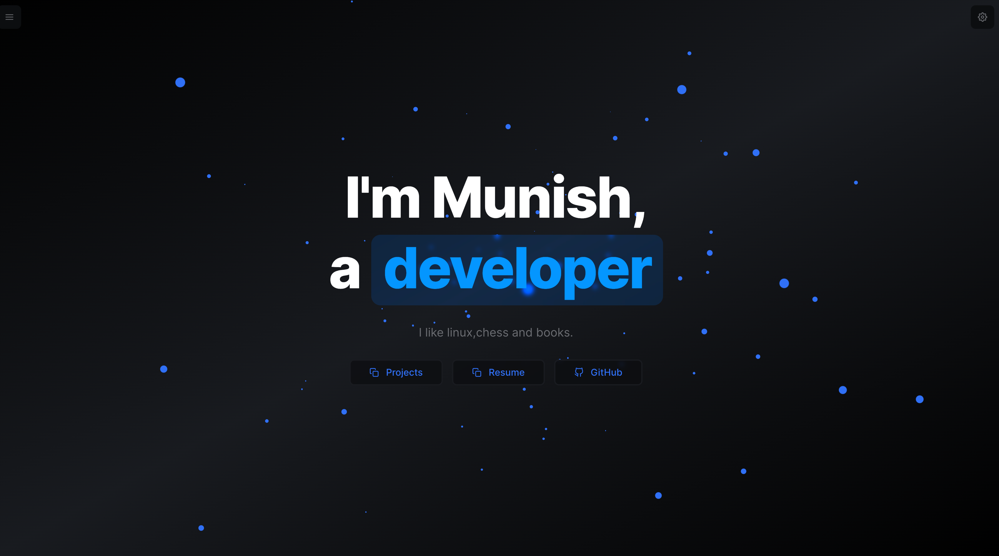

  # Personal Portfolio Website

  A modern, responsive portfolio website built with Next.js and Tailwind CSS.
<div align="center">
  <a href="https://munishdev.fun" target="_blank">
    
  </a>
  
  [Live Demo](https://munishdev.fun) | [Report Bug](https://github.com/MunishMummadi/portfolio/issues) | [Request Feature](https://github.com/MunishMummadi/portfolio/issues)
</div>

## Features

- ⚡️ Next.js 14 with Server Side Rendering
- 🎨 Tailwind CSS for styling
- 📱 Fully Responsive Design
- 🌙 Dark/Light mode
- ⚡ Optimized for performance
- 🔧 Easy to customize

## Tech Stack

- [Next.js](https://nextjs.org/)
- [React](https://reactjs.org/)
- [Tailwind CSS](https://tailwindcss.com/)
- [TypeScript](https://www.typescriptlang.org/)

## Getting Started

### Prerequisites

- Node.js 18.x or higher
- npm or yarn

### Installation

1. Clone the repository
```bash
git clone git@github.com:MunishMummadi/portfolio.git

cd portfolio

```

2. Install dependencies
```bash
npm install

```

### Development

Start the development server:
```bash
npm run dev
```

The site will be available at `http://localhost:3000`

### Build

Create a production build:
```bash
npm run build
```

### Production

Run the production server:
```bash
npm run start
```


## License

This project is licensed under the MIT License - see the [LICENSE](LICENSE) file for details.

## Acknowledgments

- Inspired by [nuro.dev](https://github.com/NuroDev/nuro.dev)

---

<div align="center">
  Made with ❤️ by <a href="https://munishdev.fun">Munish Mummadi</a>
</div>
