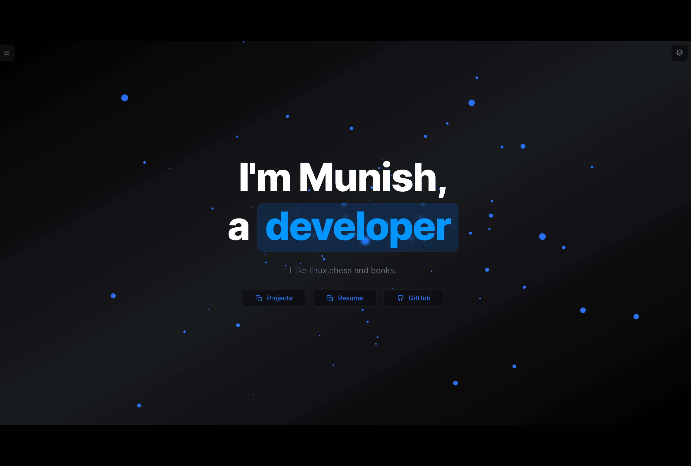

  # Personal Portfolio Website

  A modern, responsive portfolio website built with Next.js and Tailwind CSS.
<div align="center">
  <a href="https://munishdev.fun" target="_blank">
    
  </a>
  
  [Live Demo](https://munishdev.fun) | [Report Bug](https://github.com/MunishMummadi/portfolio/issues) | [Request Feature](https://github.com/MunishMummadi/portfolio/issues)
</div>

## Features

- ⚡️ Next.js 14 with Server Side Rendering
- 🎨 Tailwind CSS for styling 
- 📱 Fully Responsive Design
- 🌙 Dark/Light mode
- ⚡ Optimized for performance
- 🔧 Easy to customize

## Tech Stack

- [Next.js](https://nextjs.org/)
- [React](https://reactjs.org/)
- [Tailwind CSS](https://tailwindcss.com/)
- [TypeScript](https://www.typescriptlang.org/)

## Getting Started

### Prerequisites

- Node.js 18.x or higher
- npm or yarn

### Installation

1. Clone the repository
```bash
git clone https://github.com/MunishMummadi/portfolio.git
```

2. Navigate to the project directory
```bash
cd portfolio
```

3. Install dependencies
```bash
npm install
# or
yarn install
```

4. Create a `.env` file in the root directory and add necessary environment variables
```env
# Example environment variables
NEXT_PUBLIC_SITE_URL=http://localhost:3000
```

### Development

Start the development server:
```bash
npm run dev
# or
yarn dev
```

The site will be available at `http://localhost:3000`

### Build

Create a production build:
```bash
npm run build
# or
yarn build
```

### Production

Run the production server:
```bash
npm run start
# or
yarn start
```

## Contributing

Contributions are welcome! Please feel free to submit a Pull Request.

1. Fork the Project
2. Create your Feature Branch (`git checkout -b feature/AmazingFeature`)
3. Commit your Changes (`git commit -m 'Add some AmazingFeature'`)
4. Push to the Branch (`git push origin feature/AmazingFeature`)
5. Open a Pull Request

## License

This project is licensed under the MIT License - see the [LICENSE](LICENSE) file for details.

## Acknowledgments

- Inspired by [nuro.dev](https://github.com/NuroDev/nuro.dev)

---

<div align="center">
  Made with ❤️ by <a href="https://munishdev.fun">Munish Mummadi</a>
</div>
